# The AppContainer

_Provide a development environment for database application with the focus of Continuous Integration/Continuous Delivery (CI/CD)_

## Design Thinking Goal

Developers for database application need an easy to use and light weight development environment, which supports all methods of modern software development but with the specialities needed for database centric apps.

In particular these are:

 - Develop Web based UIs
 - Multi-developer environment using git
 - Deploy database artifacts
 - Backend for accessing database data via a Restful API
 - Unit testing
 - CI/CD pipeline for development automation

## User Journey

First and foremost is the user. So let's imagine a developer with the need to build a relatively complex database application from ground up but also consider cases where parts exist already, e.g. the database tables exist and only the UI must be built.

The development process has the following challanges:

1. Build a UI, first a mockup and then the actual solution.
2. Design the database tables and other objects.
3. Connect the UI with the database data.
4. Deploy all into production.

In all these areas the user expects quick onboarding, easy to use, can do the normal tasks easily and the uncommon are possible.

### Stage 0 - Onboarding

The IT department did download and run the AppContainer via a docker-run command. Now the development environment is available as web application under that URL and presents itself to the user as a Home screen with multiple tiles.

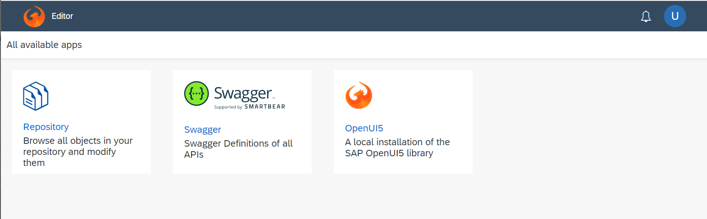

The important tile is the Repository Browser. The Swagger tile is to see the Restful APIs exposed by the AppContainer and the OpenUI5 tile links to the installed documentation of this UI framework.

### Stage 1 - Design the UI

Because the Repository is user specific and should not be accessible by everybody, the web server asks the user to login first.

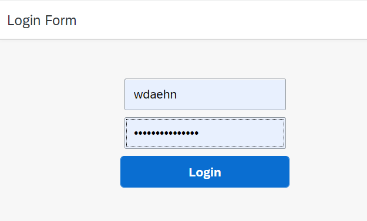

The repository browser shows on the left hand side the directory structure for the logged in user and on the right half of the screen the files in the currently selected directory.

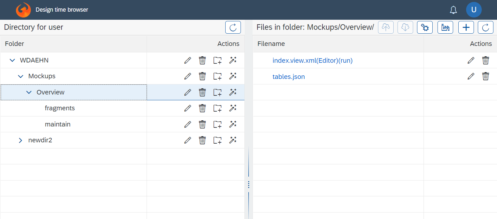

The user can do all the normal file operations, rename, delete, create, move files and directories.

To create any new file the add button is clicked

and the the name of the file to be created can be specified. In this case the user wants to create a UI screen, hence the extension *.view.xml.

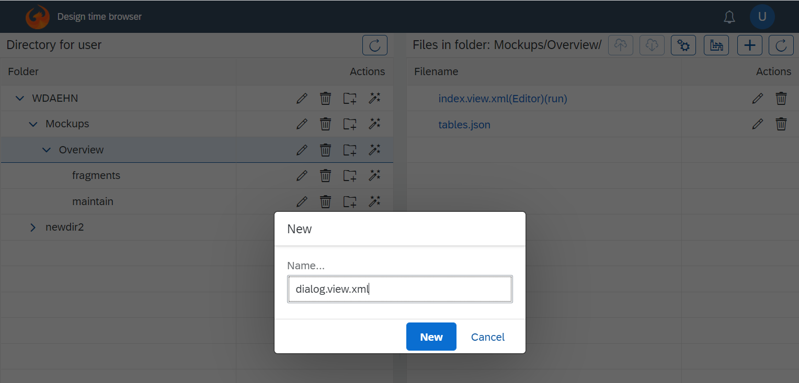

This is a regular text file and can be edit as such by clicking on its name.

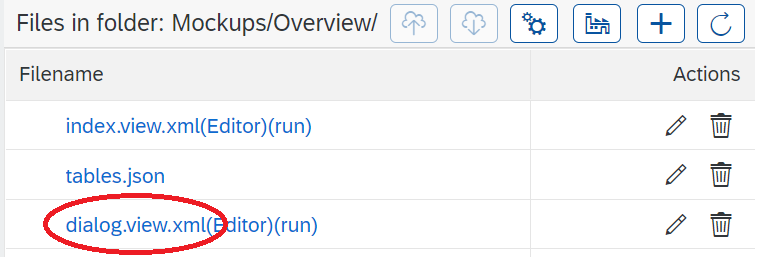

The text editor shows the empty file and allows to create the XML structure. The editor supports basic syntax highlighting.

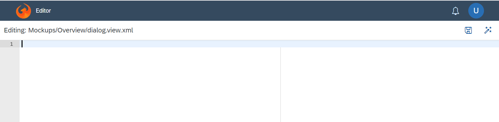

Because this is a *.view.xml file, a visual UI editor exists as well, which is opened when selecting the "editor" link instead of the file name as before.

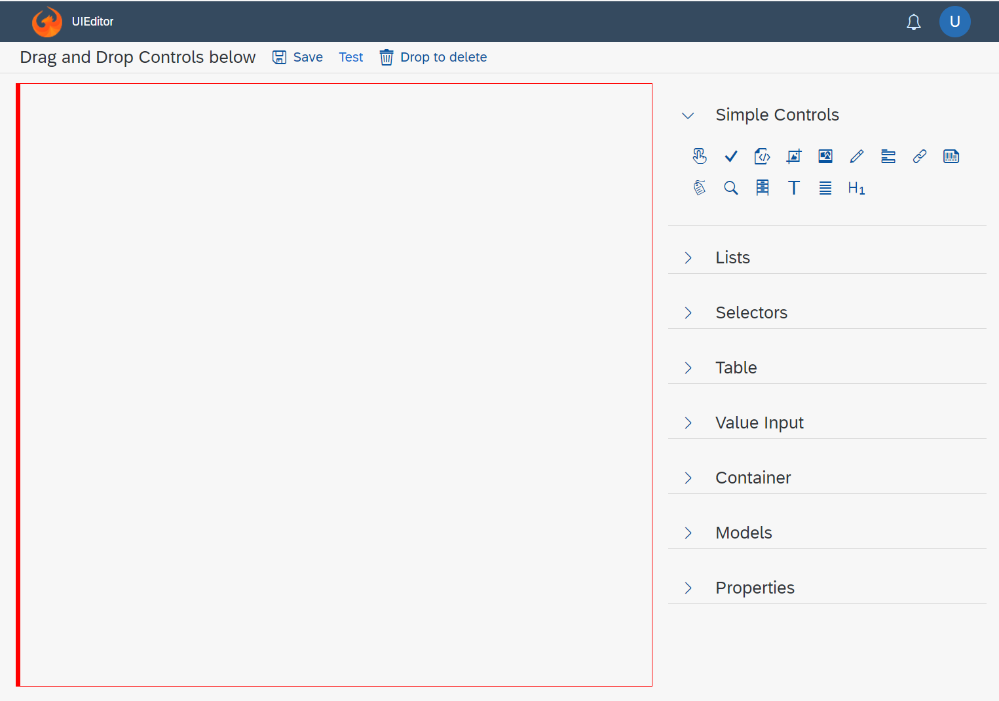

The editor modifies the controls with a border to provide a visual handle for modifying the controls.

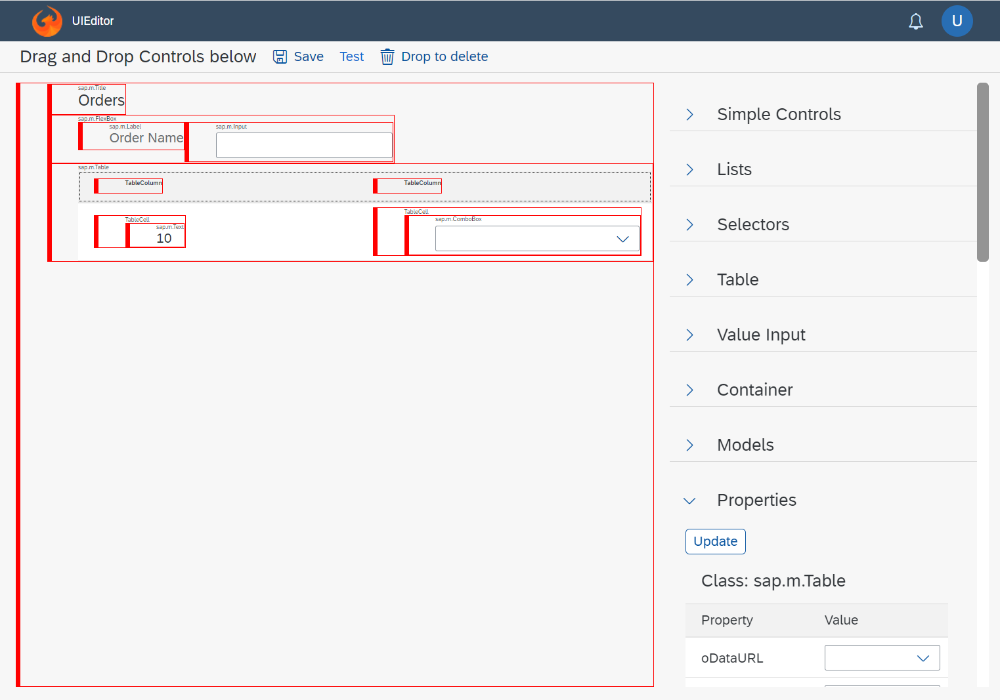

Either way, it is just another option to create or modify the view.xml which is the main component in the UI5 framework for describing the UI. Because both editors work on the same XML file, there is no limitation is starting with the one editor and switching to the other back and forth. The developer can use whatever makes more sense for the sitation at hand.

Building proper applications requires much more than just arranging UI controls. It starts with the shell bar at the top for navigation, error message visualization, a logout button. For consistency this shell bar must look identical in all screens and hence is provided as a custom control. The same control used by the AppContainer itself!

Therefore this `ui5libs.controls:ShellBar` is used as first control in the XML view. Further more the screen has an Overflow Toolbar and underneath it should render as many `items` as there are records in the `/apps` array of the `./tables.json` file. The object to render for each is the `core:Fragment`.

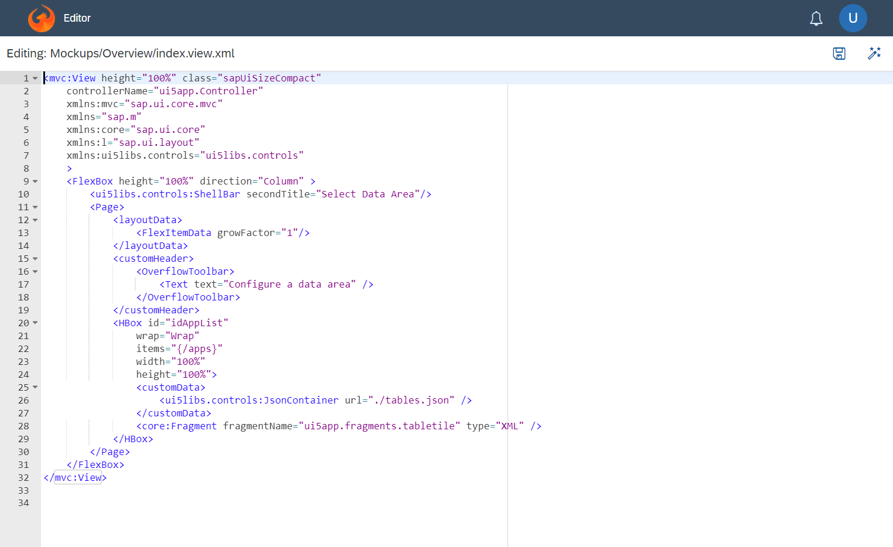

The result of this configuration looks like this.

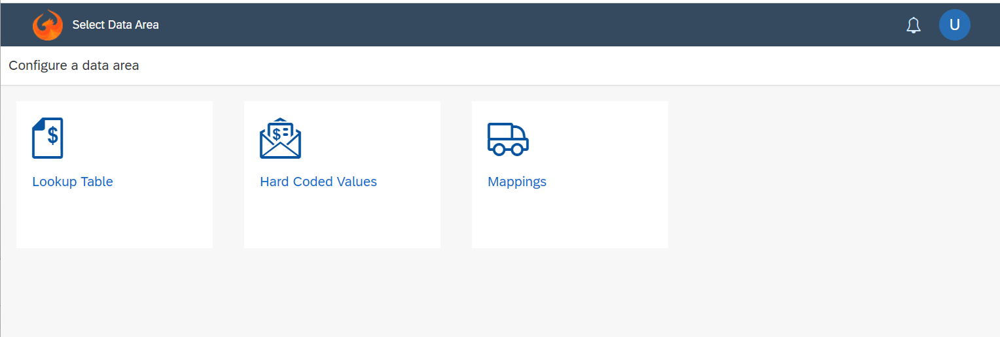

A screen with the text "Select Data Area" in the ShellBar, the text "Configure a data area" in the Toolbar and underneath three tiles horizontally arranged.

Why three tiles and with that name? Because the table.json used in the view contains the data.

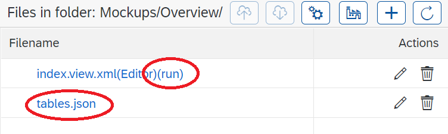

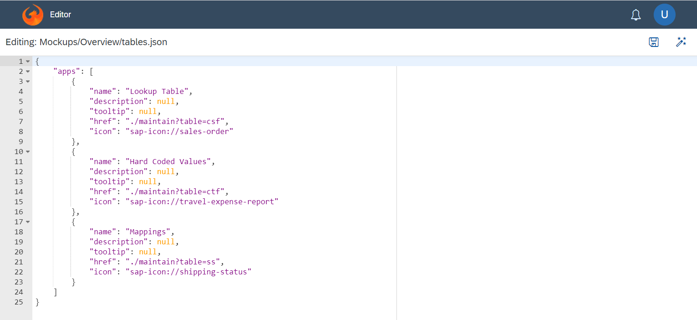

How such a tile must look like is defined using a UI5 fragment, which is another file referenced in the view.

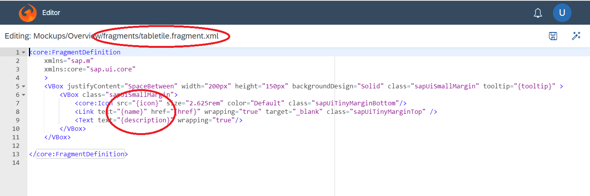

The interesting part is why it was enough to create the view.xml file to render a page. If that xml file would be opened via the browser, the browser would show the XML text and not build a UI!
In fact all UI frameworks need some additional files to work. In case of UI5 these are as bare minimum:
- a html file to bootstrap the UI framework and loading the correct view.xml file.
- a controller that does initialize the system and provides the data as model
- a manifest file with masterdata about the application
- a Component.js with global settings, e.g. where to even find the `ui5libs` files

All this boiler plate code is mandatory, similar for the various apps but not identical.
And the AppContainer generates those on the fly.

When selecting the `run` link, the opened URL is actually a html file with the same name as the view (index.view.xml --> index.html) and the AppContainer produces the content of this file to instantiate the page with the view.xml.

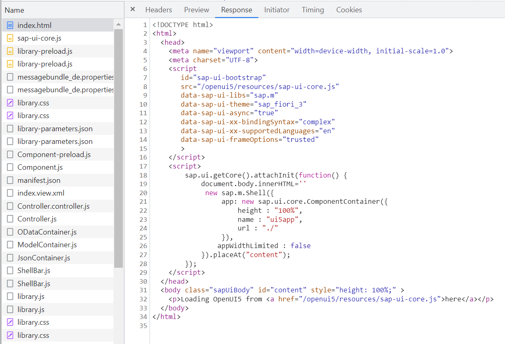

Same thing for all other required files.

The `Controller.controller.js` used to initialize the application has by default no additional coding but extends the class `ui5libs.controls.Controller.js`. This Controller goes through the control tree in the XML view and when it finds the annotation to assign a model to this control, it does create the model, loads the data (asynchronously) and sets the model to this control.

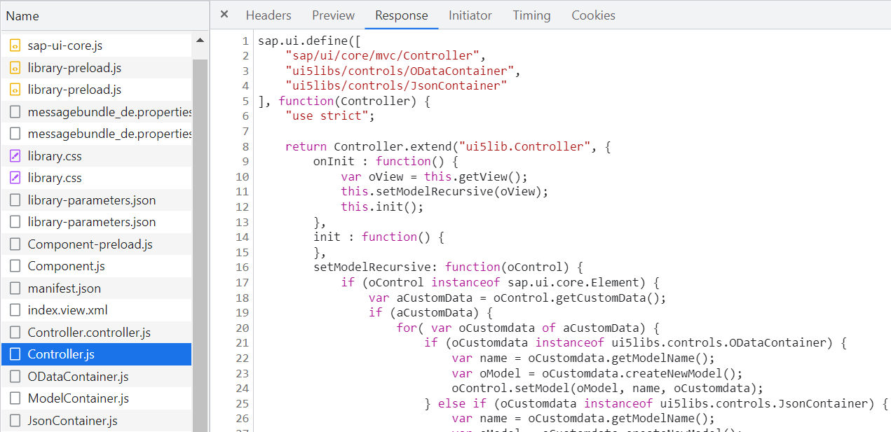

The way UI5 suggests to load a model is by specifying which model goes to what control in the Controller and to maintain the model details (URL for the data, model type,...) in the Manifest file.
For simple projects that is okay but for larger projects, where the view has a model, all the list and combo boxes, all selectors, all tables have their own models for the lookup data, it is very hard to keep the three areas in sync.
Therefore in the AppContainer the controls in the view state which data they want to show. All in one place.

