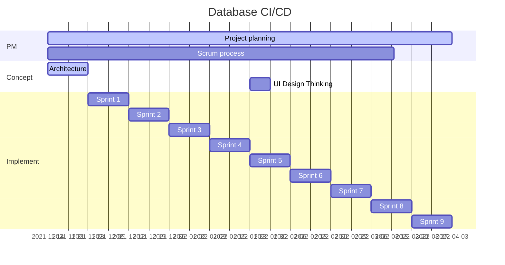

# Bachelor

_Continuous Integration/Continuous Delivery (CI/CD) in the context of database applications_

## Design Thinking Goal

The user is able to deploy database applications equally to CI/CD pipelines in classic software development. Must support the initial creation of a database application, non-destructive upgrade from each version at the customer, automated testing and git integration.

## Project phases

