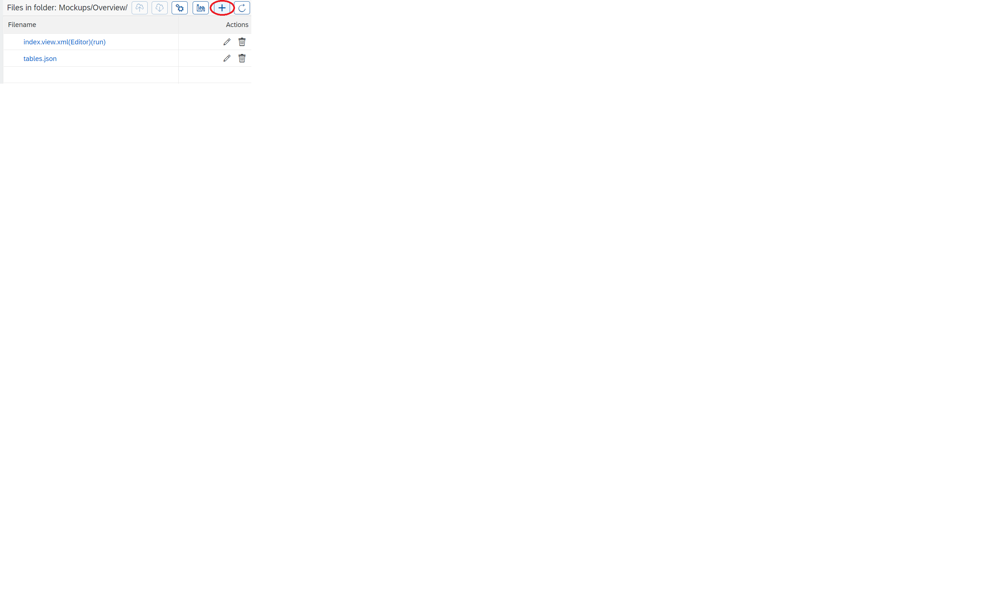

# The AppContainer

_Provide a development environment for database application with the focus of Continuous Integration/Continuous Delivery (CI/CD)_

## Design Thinking Goal

Developers for database application need an easy to use and light weight development environment, which supports all methods of modern software development but with the specialities needed for database centric apps.

In particular these are:

 - Develop Web based UIs
 - Multi-developer environment using git
 - Deploy database artifacts
 - Backend for accessing database data via a Restful API
 - Unit testing
 - CI/CD pipeline for development automation

## User Journey

First and foremost is the user. So let's imagine a developer with the need to build a relatively complex database application from ground up but also consider cases where parts exist already, e.g. the database tables exist and only the UI must be built.

The development process has the following challanges:

1. Build a UI, first a mockup and then the actual solution.
2. Design the database tables and other objects.
3. Connect the UI with the database data.
4. Deploy all into production.

In all these areas the user expects quick onboarding, easy to use, can do the normal tasks easily and the uncommon are possible.

### Stage 0 - Onboarding

The IT department did download and run the AppContainer via a docker-run command. Now the development environment is available as web application under that URL and presents itself to the user as a Home screen with multiple tiles.

The important tile is the Repository Browser. The Swagger tile is to see the Restful APIs exposed by the AppContainer and the OpenUI5 tile links to the installed documentation of this UI framework.

### Stage 1 - Design the UI

Because the Repository is user specific and should not be accessible by everybody, the web server asks the user to login first.

The repository browser shows on the left hand side the directory structure for the logged in user and on the right half of the screen the files in the currently selected directory.

The user can do all the normal file operations, rename, delete, create, move files and directories.

To create any new file the add button is clicked

