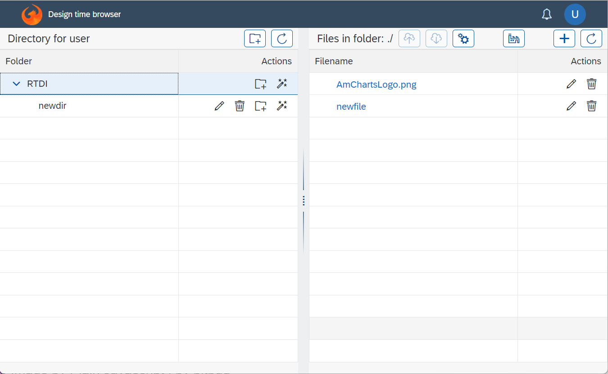
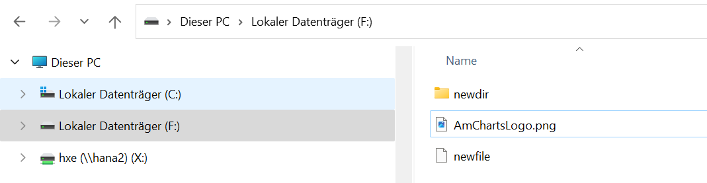

## The Repository Browse app

Every user has its own directory with all the stored data.
Usually either the entire directory or individual sub directories are connected via Git to a central repository to exchange the files.

One method to work with this repository is to use the Browse App itself to create directories, create files, rename, delete and edit text files.
The app also supports drag and drop to move files and directories or to add new files from the operating system, meaning to upload them from the local file system to the repository.

But given this is a file system, it might make sense to expose the user directory via a network share. The AppContainer allows mounting host directories and change the location of the user directory via an environment variable when starting it. Then the user can work with his files from the operating system as well.

For some file types specially tailored editors exists and it is shown then as separate "Editor" link to open the file with that.

Apart from editing files, the app is used also for

 - [Activating files](../../activationapp/docs/README.md) or all files in a directory structure: The activation process "executes" the files. What such execution does, depends on the file type. For example activating file with the suffix ".sql" means running the script against the database to create or alter tables, views, procedures. There a JUnit tests to validate proper deployment, import data into table, move html files to the pulic area of the server,...
 - [Importing](../../importapp/docs/README.md) existing database objects as design time files, e.g. a table is imported and the result is a sql script containing the create-table statement.
 - [Git operations](GitOperations.md) like clone, pull, push, configure
 
 
### Directory structure

While the application can work with any directory structure, it impacts the activation sequence. File are activated recursively in the order of

 1. Go the the directory the `.requires` file specifies - if present
 1. All files in the directory in alphabetic order
 1. Each sub-directory in alphabetic order

If there must be a specific sequence of files to be activated, above rules should be used. The simplest way is to group object types in directories and prefix them with a number.

Example:

 - 01_tables
    - 01_customer.sql
    - 02_order.sql (because it defines a foreign key to the customer table)
 - 02_views
    - level1
       - ...
 - 03_data
   - regions.csv