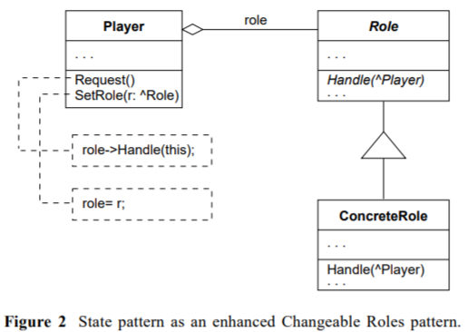

# Design Patterns

## SQL Script parser

The SQL script parser is implemented as State Pattern [(_[1] Pree, 1995_)](#1).

It is based on the IParser interface and implements a read() method, reading character after character.
Depending on the state the read text has different meanings, e.g. within double quotes it is plain text and the only subsequent state possible is when an escape char is found to escape an inline double quote character.

The root class is the SQLParser which initializes the start state.

## UI screens

All UI code follows the Model-View-Controller design pattern. The model is described as a Json object, initialized in the controller and the view is described as XML tree of controls with model binding information.

## References

<a id="1">[1]</a> Pree, W. (1995). "State-of-the-art Design Pattern Approaches—An Overview. Technology of Object-Oriented Languages and Systems (TOOLS 95).", pp. 7-8 [link](http://citeseerx.ist.psu.edu/viewdoc/download?doi=10.1.1.28.5123&rep=rep1&type=pdf).

