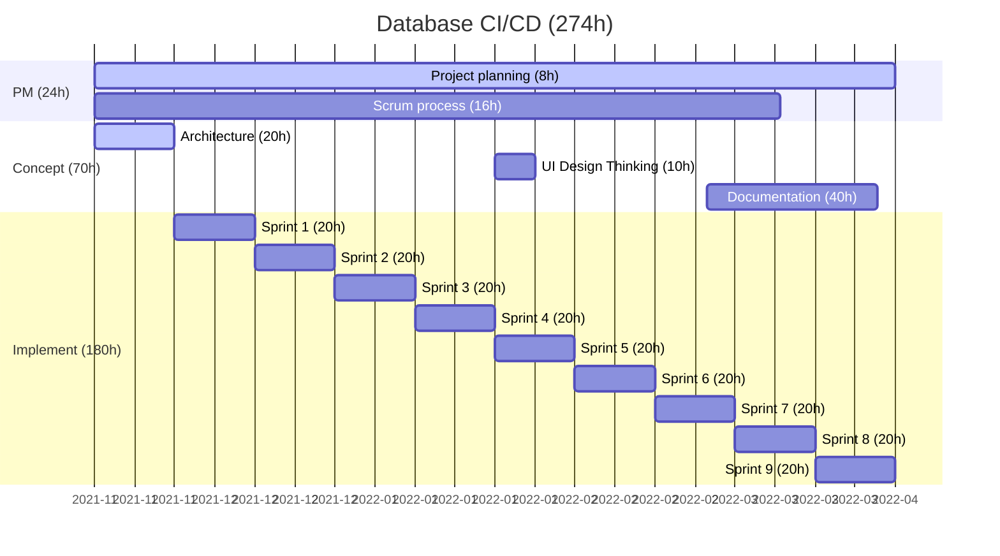

# Project Plan

The project is implemented following the Scrum philosophy of collecting backlog items, taking them on demand and implementing those in sprints. 
As such there are little dependencies between the items and some are marked as stretch goal.

## Project phases

## Time budget

For a two week task 20h of work are allocated.
Hence the entire time budget is 274h.

Time tracking is done using the Swipetimes app plus entered in the Gitlab issues as /spend comment.

