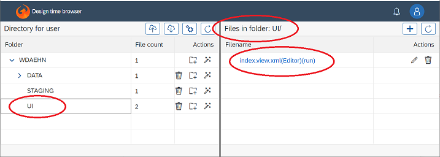
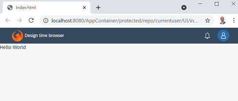

## UI Development

To build an OpenUI5 application, a lot of files and settings must be created. 
In order to simplify the process, the basic principle is that the web server creates a good default automatically.
If the file does not exist, it is created, else the provided one is used.

### Hello World

To build a basic OpenUI5 application within a directory (here the `UI` directory), only an `index.view.xml` file is required.



Example:

```
<mvc:View height="100vh"
	xmlns:mvc="sap.ui.core.mvc" 
	xmlns="sap.m"
	xmlns:ui5libs.controls="ui5libs.controls">
	<ui5libs.controls:FloorPlanSingle pageTitle="Hello World">
		<Text text="Hello World" />
	</ui5libs.controls:FloorPlanSingle>
</mvc:View>
```

This tells that there should be a [View](https://openui5.hana.ondemand.com/api/sap.ui.core.mvc.XMLView) with the height spanning the entire browser window, inside is a [FlexBox](https://openui5.hana.ondemand.com/api/sap.m.FlexBox) with the actual controls. The first control is a custom version of a [ShellBar](https://openui5.hana.ondemand.com/api/sap.f.ShellBar), the second the [Text](https://openui5.hana.ondemand.com/api/sap.m.Text) control.

The `xmlns` properties are needed to fully qualify the elements.
For example the `Text` is actually the `sap.m.Text` and the `xmlns="sap.m"` sets the default name space. That is the reason why `Text` by itself works. Then there are two more namespaces, `mvc:View` is is the alias for the `sap.ui.core.mvc.View` and `ui5libs.controls:FloorPlanSingle` for `ui5libs.controls.FloorPlanSingle`.

When opening the following URL (yes, a html file of same name like the view - it get generated on the fly)

```
http://<hostname>/AppContainer/protected/repo/currentuser/UI/index.html
```

this application renders as:




Looking at the page from the browser's point of view, additional content is created automatically:

- index.html: The code to bootstrap the OpenUI5 application, place a Shell with a ComponentContainer into the page.
- Component.js: Initializes the ComponentContainer and sets the tab title to the manifest's `sap.app -> title` value.
- manifest.json: If a file `index.html` is the name of the html file, the id is `index`, title is `index.html` and the view file name `index.view.xml`.
- ui5libs: A set of commonly used controls and libraries, most important the `ShellBar`.


Very likely the `manifest.json` will be placed into the same directory to customize title and similar settings. The bare minimum settings: sap.app -> id, sap.app -> title, sap.ui5 -> rootView.

Example:

```
{
	"sap.app": {
		"id": "Hello_World",
		"type": "application",
		"title": "Hello World"
	},

	"sap.ui5": {
		"rootView": {
			"viewName": "ui5app.index",
			"type": "XML"
		}
	}
}
```

Note: Full syntax options are described [here](https://openui5.hana.ondemand.com/topic/be0cf40f61184b358b5faedaec98b2da.html#loiobe0cf40f61184b358b5faedaec98b2da/section_nonamespace).


## Resource roots

In UI5 there is the term of "resource roots" and above two were used already: `ui5libs` and `ui5app`.
Resource roots are essentially a directory, a browser URL pointing to a location where the files can be found. Normally these have to be defined by hand in either the html page or the Component.js but for the user's convenience a few are created by default.

- ui5app: Is the directory where the current application is located, in other words where the view and all other application specific files are located. If the URL of the html file is `/AppContainer/protected/repo/currentuser/UI/index.html` then the ui5app URL is `/AppContainer/protected/repo/currentuser/UI/` and by specifying in the manifest.json to load the `ui5app.index` xml view, the file `/AppContainer/protected/repo/currentuser/UI/index.view.xml` is read by the browser.
- ui5libs: A location where a couple of useful controls and libraries can be found, either in that folder directly or in sub-directories.
- am4charts: Controls to create nice charts
- ui5rest: The location where the webserver exposes restful endpoints, see Swagger on the web server instance.
- ui5odata: The location where all oData services are provided, see Swagger -> Information category -> odataendpoints
- ui5root: Just for convenience, the root of this web application, in most cases `/AppContainer`.
- ui5externallibs: Points to the web application `/ui5externallibs` where users can add customer libraries.


## Next steps

### Add a Controller to the view

By adding the property `controllerName` into the view tag, a JavaScript file with Business logic is added to the application as well. Assuming it is in the same directory as the view file, its name should start with the resource root `ui5app.`. In the example below, next to the view a file `Controller.controller.js` is expected.

```
<mvc:View height="100vh"
	controllerName="ui5app.Controller"
	xmlns:mvc="sap.ui.core.mvc" 
	xmlns="sap.m"
	xmlns:ui5libs.controls="ui5libs.controls">
```


### Add models to the view

Building data driven UIs needs data, a so called model object. These models can be attached to the view, any control and can either be the default model (no model name) or a named model.
If a control asks for a model, it checks if the control itself has the requested model, its parent, ... down to the view.

The models can be defined in the controls, in above view controller, in the manifest.json,... there are many options all with their pros and cons.

If a page has e.g. multiple drop down boxes or other list selectors, the most natural way would be to make the model part of the control.
This is not supported out of the box but the ui5libs contain the `ui5init` library to achieve that.

#### oData

If a control has a customData element of type `ui5libs.controls:ODataContainer` and the controller extends the `ui5libs.controls.Controller`, the `url` property is taken and an ODataModel created for this control automatically.

```
<mvc:View height="100vh"
	controllerName="ui5app.Controller"
	xmlns:mvc="sap.ui.core.mvc" 
	xmlns="sap.m"
	xmlns:ui5libs.controls="ui5libs.controls">
	<ui5libs.controls:FloorPlanSingle pageTitle="Hello World" >
		<Text text="{/TABLE(1)/ROLE_NAME}">
	    	<customData>
	    		<ui5libs.controls:ODataContainer url="ui5odata/INFORMATION_SCHEMA/APPLICABLE_ROLES/" />
	    	</customData>
	    </Text>
	</ui5libs.controls:FloorPlanSingle>
</mvc:View>
```

In this example the Text control gets an ODataModel assigned with the oData service endpoint `ui5odata/INFORMATION_SCHEMA/APPLICABLE_ROLES/`.
The text rendered is the content of the first row, the ROLE_NAME field `/TABLE(1)/ROLE_NAME`.

This model assignment is done implicitly by the Controller. In this example the `Controller.controller.js` looks like

```
sap.ui.define([
	"ui5libs/controls/Controller"
], function(Controller) {
	"use strict";

	return Controller.extend("ui5app.Controller", {
		onInit : function() { // Option 1
			Controller.prototype.onInit.apply(this, arguments);
		},
		init : function() { // Option 2
		}
	});

});
```

It is using the Controller class provided by the AppContainer as parent control and its `onInit()` function does all the magic. Hence the developer has two options, either implement the onInit() function but call the parent's `onInit()` first or implement just the `init()` function which is called by the `onInit()`.


#### Json Restful

oData is a good choice for larger data sets as it provides pagination, filter, sort and much more. But for simple things, normal Json is easier.
Using the same approach but with customData of type `JsonContainer`, a JSONModel is attached to the control.

Example:

```
       ...
		<Text text="{/NAME}">
	    	<customData>
	    		<ui5libs.controls:JsonContainer url="ui5app/sample.json" />
	    	</customData>
	    </Text>
	    ...
```

This instructs the Controller to read a Json file from the given location, here a file called sample.json in the same directory where the view is. 
Its contents are

```
{
    "NAME" : "Json Data"
}
```

Therefore the Text control will show the text "Json Data".

#### other options

But as said, all other methods work as well. This is just a convenience method for this AppContainer.

see [here](https://sapui5.hana.ondemand.com/#/topic/68b9644a253741e8a4b9e4279a35c247)


