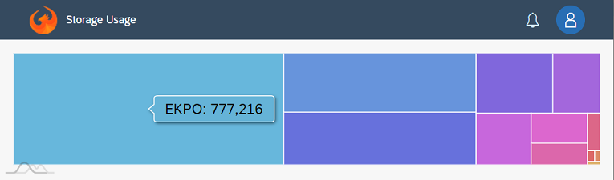

## Using am4charts

[amCharts](https://www.amcharts.com/demos/) is a powerful charting library and was embedded into this AppContainer.
To allow for maximum flexibility, the amcharts are configured via its json method.

A very basic example has as view definition:

```
<mvc:View height="100vh"
	controllerName="ui5app.Controller"
	xmlns:mvc="sap.ui.core.mvc" 
	xmlns="sap.m"
	xmlns:ui5libs.am4charts="ui5libs.am4charts"
	xmlns:ui5libs.controls="ui5libs.controls">
	<ui5libs.controls:FloorPlanSingle>
		<ui5libs.am4charts:Chart id="chart1" charttype="TreeMap" config="ui5app/StorageDistribution.json" width="100%" height="100%">
			<ui5libs.am4charts:layoutData>
				<FlexItemData growFactor="1" />
			</ui5libs.am4charts:layoutData>
		</ui5libs.am4charts:Chart>
	</ui5libs.controls:FloorPlanSingle>
</mvc:View>
```

Note: The `FlexItemData growFactor="1"` just tells that this item, the chart, should take all remaining space.

The `ui5libs.am4charts` namespace is defined and a `Chart` control created. 
The only information needed is the base `charttype`, a string with one of

- PieChart
- XYChart
- MapChart
- RadarChart
- TreeMap
- SankeyDiagram
- GaugeChart
- ChordDiagram
- SlicedChart
- Sunburst
- WordCloud
- ForceDirectedTree
- CurveChart
- VennDiagram

Note that amChart requires just the base chart type. There is no chart type for a BarChart, it is an XYChart with Bars as series items.

To define the settings the amCharts json config method is used. The `config` defines where the configuration file can be found. The contents are specific for each diagram.

Example:

```
{
	"dataSource": {
		"url": "ui5rest/query?$select=SELECT TABLE_SCHEMA, TABLE_NAME, ROW_COUNT, BYTES FROM INFORMATION_SCHEMA.TABLES WHERE ROW_COUNT > 0"
	},
	"dataFields": {
		"value": "BYTES",
		"name": "TABLE_NAME"
	}
}
```

It is using the ui5rest end point called `query`, which allows to execute any database select statement. From the returned columns the chart is using TABLE_NAME as name and BYTES as value.

The result is a TreeChart below the ShellBar showing the size of the various tables in relationship to each other.




### Providing data

To provide the chart with data, above option where the config Json contains the `dataSource` element with an URL is one option.
Another option is using the UI5 Models. The chart supports an aggregation `items` and all data provided by that is also available for the chart.

Example:

```
<ui5libs.am4charts:Chart
    charttype="TreeMap"
    config="ui5app/StorageDistribution.json"
    items="{/TABLE}">
    <core:Item key="{TABLE_NAME}" text="{BYTES} {ROWS}" />
    <ui5libs.controls:customData>
        <ui5libs.controls:ODataContainer url="ui5odata/INFORMATION_SCHEMA/TABLES" />
    </ui5libs.controls:customData>
</ui5libs.am4charts:Chart>
```

In this example the model is assigned via the customData method, the `items` aggregation has as many records as the oData service fetches and which columns read is defined in the `Item` template.

Note that the `Item` template is actually not used. It only exists to bind a subset of the columns to the model so the oDataModel fetches data for these columns only.


